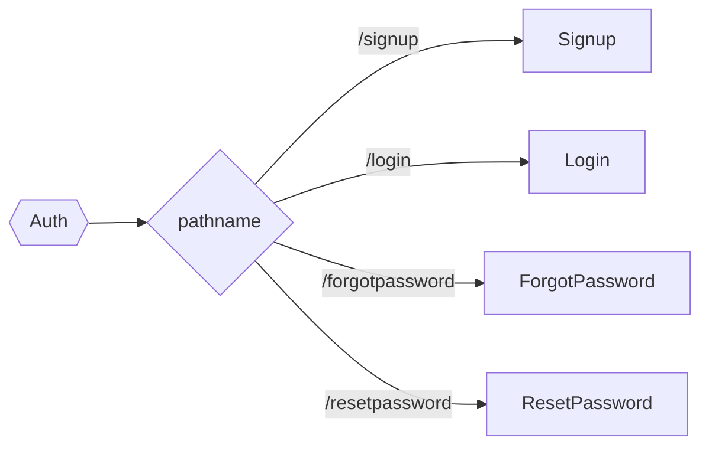
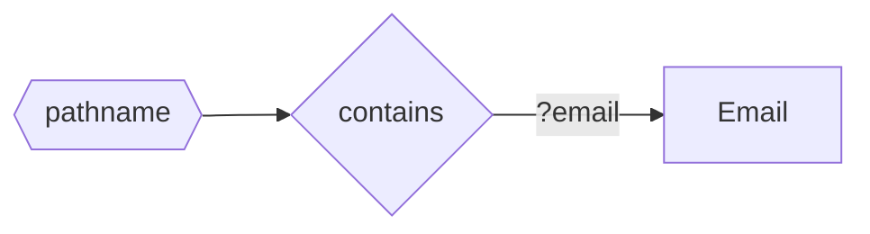
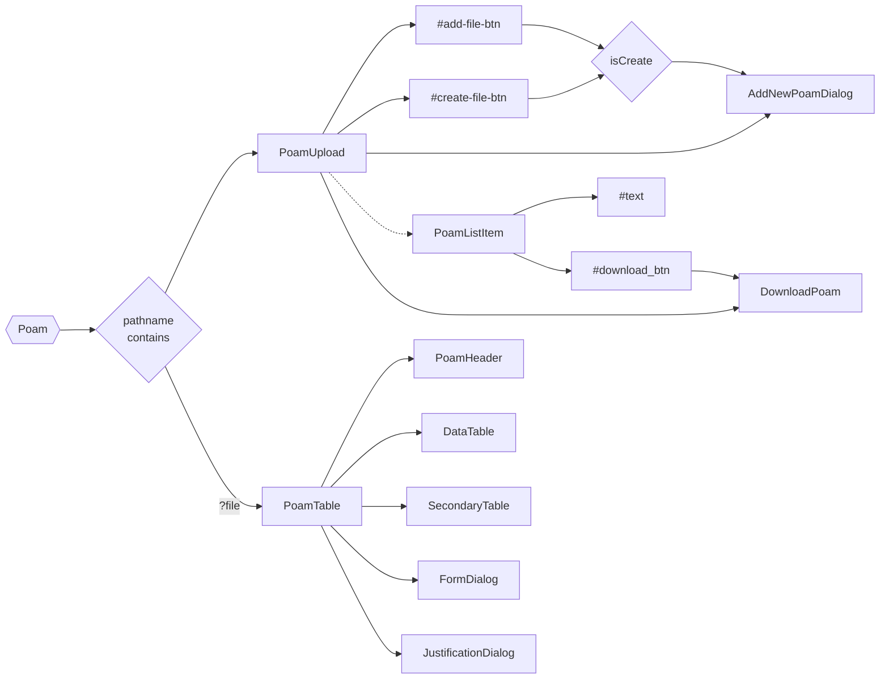
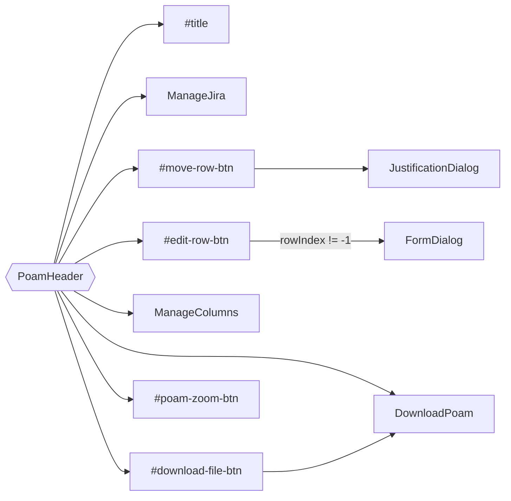

# CNCM Falcon

_Cloud Native Compliance Maven (CNCM) is a platform that automates the compliance processes of organisations and provide secure cloud services. We operate using P2P model with a agile based Software Development Lifecycle (SDLC) methodology._

- **Technology stack :**

  - Frontend: react/Material UI
  - Backend: python/django
  - Database: PostgresSQL

- **Status :**
  Currently in the early development phase

- **Live Working Model :** [check out](https://dev-falcon.vercel.app/)

## Installation

- Clone / Download project:

```
git clone https://github.com/cncm-inc/compliance-frontend.git
```

- Change to develop Branch:

```
git checkout develop
```

- Install all dependencies in your local machine:

```
npm install
```

- Run the project:

```
npm start
```

## Dependencies

- **Material UI** ( @material-ui/core )
  - For Styling & Icons.
- **Moment** ( moment )
  - For Date conversion and picker support.
- **Axios** ( axios )
  - Handling API data & Promises.
- **Country & Calling code** ( country-codes-list )
  - Provideing list of country & their calling codes.
- **File Drag n Drop** ( react-file-drop )
  - Component to manage, different state of drag-n-drop of file.
- **Full Screen** ( react-full-screen )
  - Wrapper & hooks for mount component on Full-screen view.
- **React Hook Form** ( react-hook-form )
  - Form validation & submit & error responses.
- **React Toast** ( react-toastify )
  - Generate Notification popup, and manages them.
- **xlsx** ( xlsx )
  - Module to create excel files.
- **TESTING**
  - **prop-types ➜** Module to define types for props for testing.
  - **@wojtekmaj/enzyme-adapter-react-17 ➜** React 17 enzyme adapter.
  - **enzyme ➜** Enzyme to write test-case.

## Facade <font size="3">(Wrapping external module inside code)</font>

- [CrudFactory](./src/Service/CrudFactory.jsx)
  - Wrap Axios Logic
  - Expose get, post, put, delete method to use
- [Form](./src/Components/Utils/Control/Form.jsx)
  - Wrap react-hook-form Logic
  - Expose
    - Form ➜ to wrap all input fields, handle submit & provide control to fields through context.
    - Field ➜ to wrap controls inside react-hook-form logic and send value, onchange and other props to field.

## Pages

#### [Auth](./src/Pages/Auth.jsx)



#### [Email](./src/Pages/Email.jsx)



#### [POA&M](./src/Pages/Poam.jsx)



### [PoamHeader](./src/Components/Poam/PoamHeader.jsx)



## Git Guidelines

1. Commit / Stash / Remove all uncommited files.
2. Pull from develop branch.
3. run `npm install`.
4. Go to [github issue](https://github.com/cncmllc/falcon-frontend/issues).
5. Select assigned issue.
6. Click on **Create a branch** in Deployment section.
7. Rename Branch Name as **Issue-name-your-initial**, keep rest as default.
8. Click on Create Branch and copy commands.
9. Run command on local.
10. Make your changes.
11. Update README file, if required.
12. Commit Code as

```
Issue name - your-initial
    - Commit message
```

13. Push your code & inform lead.
